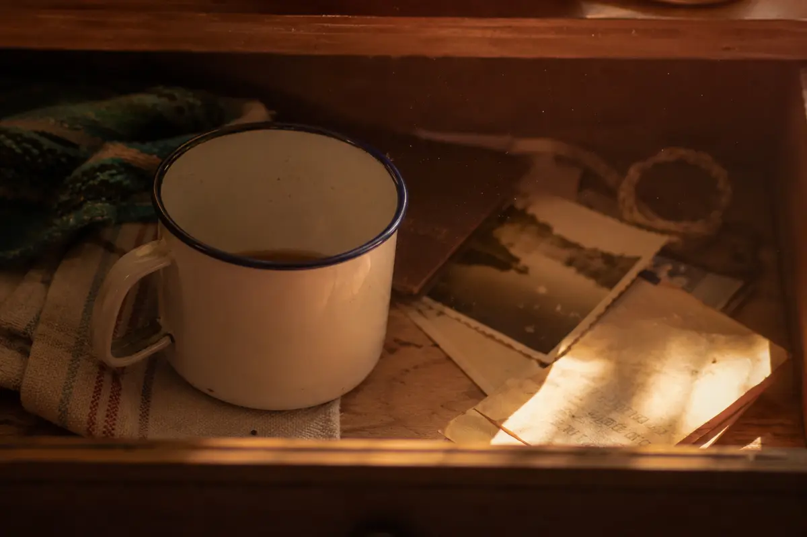

There is a tiny blue dot on the floorboards when the phone is tilted just so.

Most nights, it is nothing. It is not even a dot, exactly. It is a reflection from some bright corner of the screen, a little spilled pixel trembling beside the chair leg. It appears only when the room is dark enough and the hand is tired enough to let the phone sag. It lives in the pause between one video and the next.

That is the hour when scrolling becomes less like choosing and more like letting the thumb keep a machine alive. A recipe. A stranger's hallway renovation. A person explaining a thing I will forget before the sentence ends. A headline that enters the chest before it reaches the mind. Another little square of life, then another.

The blue dot waits through all of it.

At first I notice it with annoyance, as if even the floor has joined the screen. But then it looks familiar. Not important-familiar. Not the kind of memory that arrives carrying a name. More like the feeling of finding an old key in a drawer and knowing, before knowing to what, that it once opened something.

It reminds me of the small plastic night-light in the hallway of a house I have not lived in for years. The one that made the baseboards glow a watery blue after everyone had gone to bed. I remember walking past it as a child, half asleep, careful not to wake the adults, with the whole house rearranged by darkness into something more mysterious than furniture. The refrigerator hummed. Pipes clicked softly in the wall. Somewhere, a clock gave its patient little cough.

Nothing happened in that memory. That may be why it has lasted.

So much of a day asks to be useful, impressive, answered, optimized, posted, cleared. Even rest becomes a task with better and worse methods. But the blue dot on the floor has no ambition. It is only an accident of light. It has no lesson except the one accidents sometimes carry: you are still in a room, in a body, in time.

The phone keeps offering more. The floor offers one thing and lets it be enough.

And because memory is strange, that small blue reflection opens into other small lights: the green clock on a microwave, the amber bead on a cassette player, the red tip of an old power strip under a desk. Household stars. Quiet evidence that the night was holding itself together while no one was looking.

The scrolling does not become noble. It was still mostly wasted time. But the mood changes. The thumb slows down. The feed looks flatter, less demanding. The room grows back around the screen. The chair has weight. The window has a dark square of sky in it. Somewhere in the apartment, something settles with a soft wooden tick.

Pleasant nostalgia is not always a grand return. Sometimes it is only the body recognizing the color of a former evening.

I put the phone face down for a minute. The blue dot vanishes. The floor is just the floor again.

That feels, somehow, like being given something back.
