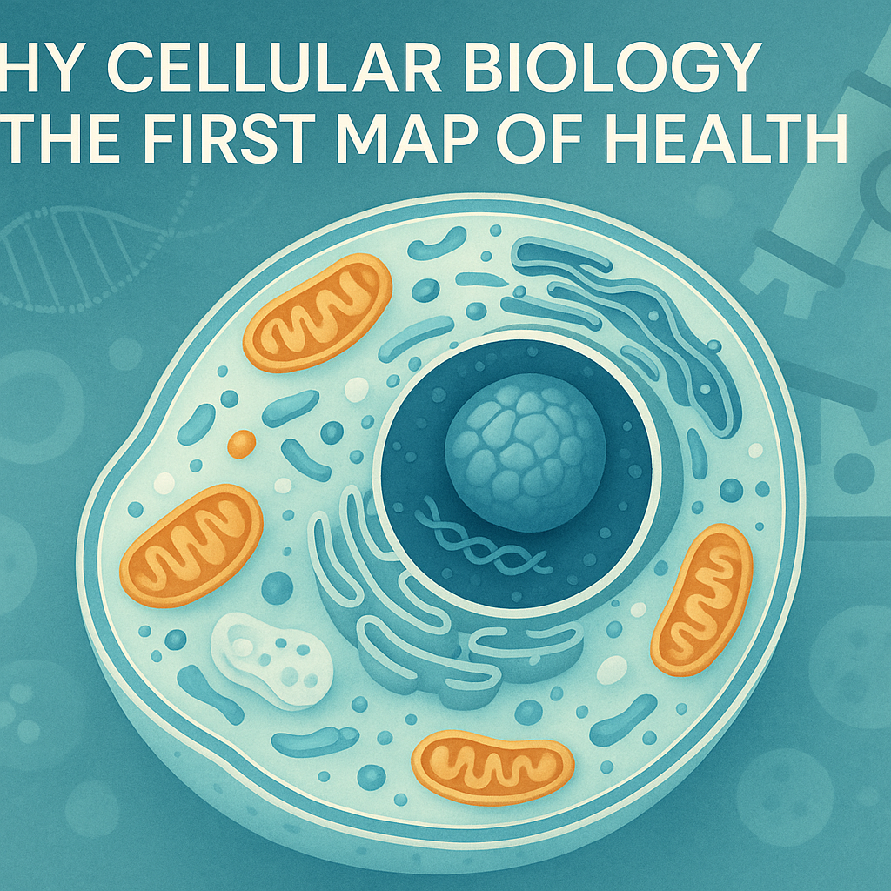

*Cellular biology begins with organized work inside living cells.*

Cells are often introduced as the basic unit of life. That phrase is accurate, but it can sound almost too small for what a cell actually does. A cell is not a passive container. It is an organized, responsive, energy-using system that reads instructions, builds materials, senses its surroundings, repairs damage, and communicates with its neighbors.

That is why cellular biology matters. It gives us the first practical map of health: not health as a slogan, but health as coordinated work happening at a scale too small to see with the naked eye.

## The cell is organized, not crowded

The illustration that inspired this article shows several familiar symbols of cell biology: DNA, a large cell with internal structures, small microbes, a chain of cells, and a microscope. Each symbol points to the same idea. Living systems depend on organization.

Inside a human cell, the nucleus protects genetic information. The cell membrane controls what enters and leaves. Mitochondria help convert fuel into usable chemical energy. Ribosomes assemble proteins. Other internal compartments help package, transport, recycle, and regulate the materials a cell needs.

The point is not to memorize every structure. The more useful point is that a cell survives by dividing labor. Biology is not chaos at miniature scale. It is a set of interacting systems.

## DNA is an instruction library, not a destiny sentence

DNA carries genetic information, but cells do not simply “have DNA” and then behave automatically. They read, regulate, copy, repair, and respond to genetic instructions. Genes can be switched on or off in different contexts, and the proteins made from those instructions carry out much of the cell’s daily work.

This is one reason modern biology has moved beyond simple one-gene, one-outcome thinking. The same genome can support many cell types because different cells use different parts of the instruction set. A nerve cell, immune cell, skin cell, and muscle cell all share the same basic genetic library, but they do not read it in the same way.

That distinction matters for public understanding. Genes matter deeply, but biology also depends on timing, environment, regulation, repair, energy, and communication.

## Energy is part of the story

Mitochondria are often called the powerhouses of the cell, and the shorthand is useful as long as it does not flatten the story. Mitochondria help generate ATP, the molecule cells use as an immediate energy source. But they are also involved in signaling, stress responses, and cellular quality control.

A cell cannot make good decisions without energy. Repairing tissue, moving materials, maintaining boundaries, sending signals, and building proteins all require coordinated energy use. When cellular energy systems are strained, the effects can ripple into larger biological patterns.

That does not mean every symptom or disease can be reduced to mitochondria. It means health is partly a question of whether cells have the resources and regulation they need to do ordinary work well.

## Cells are social

It is tempting to think of cells as isolated units. In the body, they are anything but isolated. Cells receive signals, attach to neighboring structures, respond to hormones and immune messages, and change behavior when tissue conditions change.

This social quality is one reason cell biology connects so naturally to medicine. Inflammation, healing, cancer, infection, aging, metabolism, and immunity all involve changes in how cells sense, respond, divide, repair, or communicate.

The microscope in the image is more than a science icon. It represents a change in perspective. When we look closely enough, disease is not only something that happens to organs. It is also something that unfolds through cell behavior.

## Why cellular biology belongs in a science blog

Cellular biology can feel technical, but its central questions are very human:

- How does the body build and maintain itself?
- How does it recognize damage?
- How does it know when to repair, divide, defend, or rest?
- What happens when normal signals become distorted?

These questions do not require hype. They require careful attention. The cell is not a magic black box; it is a living system with rules, limits, and remarkable adaptability.

For readers, the value of cellular biology is not that everyone needs to become a specialist. The value is that it gives us a better way to think. Health is not just a collection of organs, lab values, or symptoms. It begins with countless small acts of coordination, repeated across trillions of cells, every moment we are alive.

Understanding cells does not make life less mysterious. It makes the mystery more specific.

## Further reading

- NIH National Institute of General Medical Sciences: basic biomedical research on genes, proteins, and cells: https://www.nigms.nih.gov/
- NCBI Bookshelf, Molecular Biology of the Cell: https://www.ncbi.nlm.nih.gov/books/NBK21054/
- NHGRI genetics glossary on mitochondria: https://www.genome.gov/genetics-glossary/Mitochondria
- NCBI Bookshelf, How Cells Read the Genome: https://www.ncbi.nlm.nih.gov/books/NBK21050/
